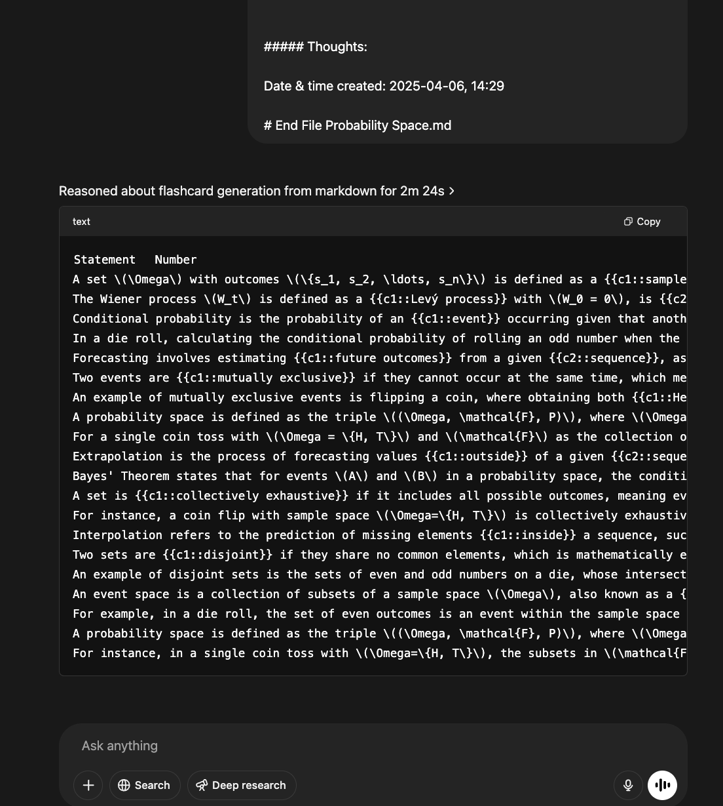
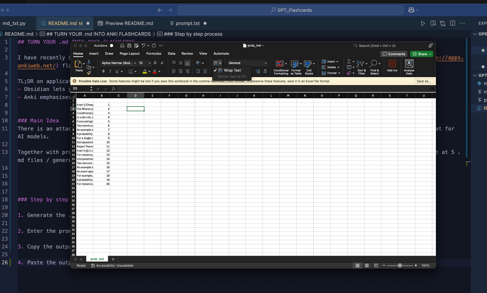
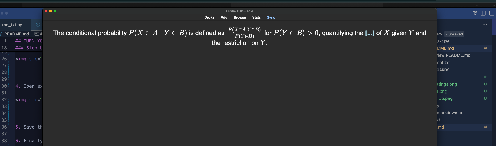

## TURN YOUR .md INTO ANKI FLASHCARDS

I have recently began using [Obsidian](https://obsidian.md/) again, and realise they contain the perfect ingredients for [anki](https://apps.ankiweb.net/) flashcards.

TL;DR on applications
- Obsidian lets you link notes together, to emphasize connections between ideas.
- Anki emphasises active recall by spaced repetition.

### Main Idea
There is an attached python script which, given a path, screens a folder for markdown files and converts them into a digestable format for AI models.

Together with prompt.txt and the collected .md files, an AI model such as chatGPT 03-mini can easily make solid flashcards (sweetspot at 5 .md files / generation).

### Step by step process

1. Generate the .txt file (call it **text**) with the code and a path to your .md files

2. Enter the prompt into a LLM together with the **text**

3. Copy the output provided by the model

4. Open excel, press the first box, paste the output, and then use *wrap text* (it should then look like the image)

5. Save the file as a .csv file

6. Finally, enter it into Anki with the corresponding settings (important that cloze is selected)

You should now have something like below

Note that you will probably have more flashcards than notes prompted for, as the model often produces more flashcards than notes inserted.